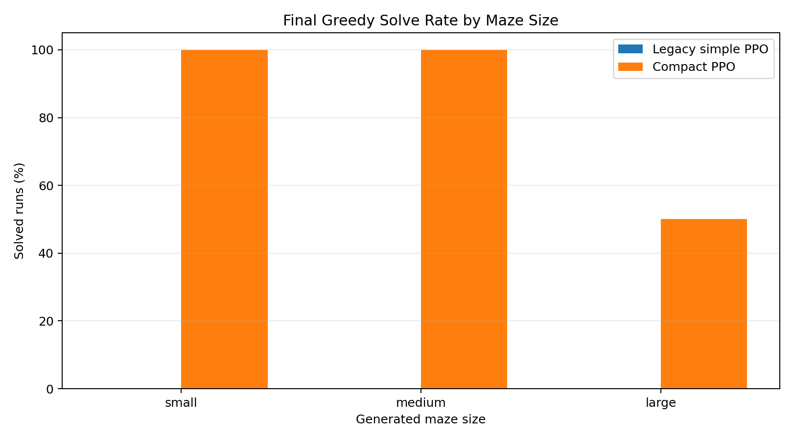
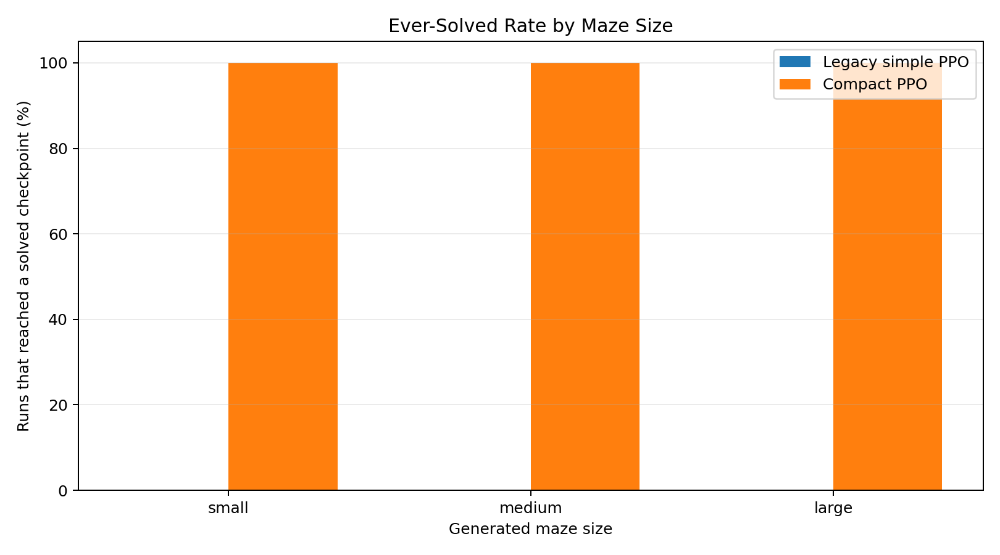
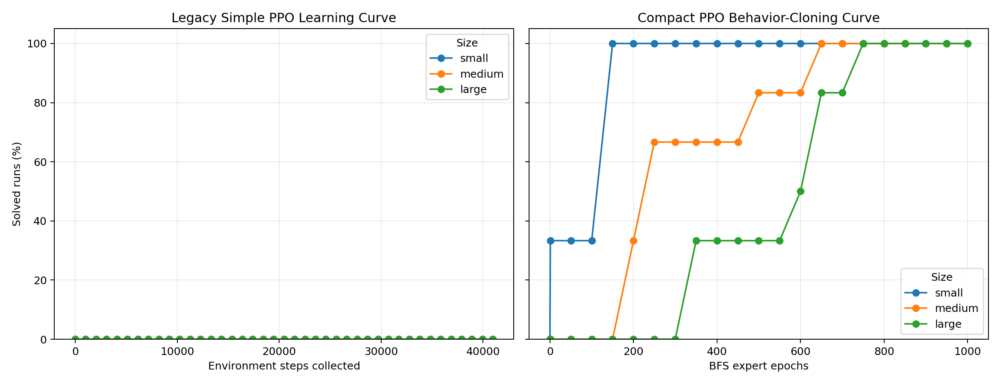
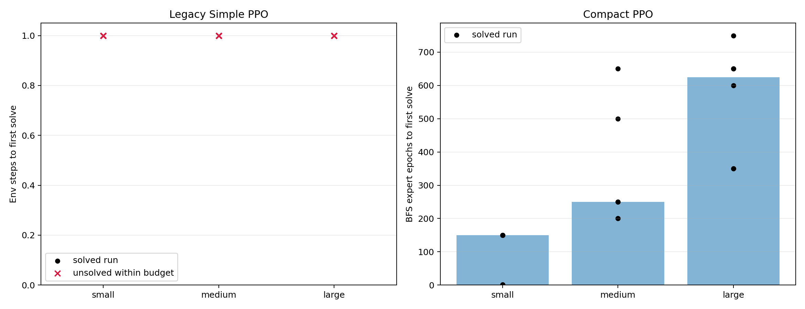
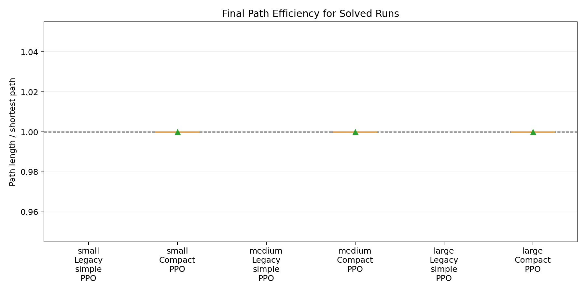

# PPO Size Learning Experiment Report

## Purpose

This experiment estimates how much training is needed for two simple PPO-style
models to solve generated mazes at the same size they train on. Each run trains
on one generated maze and evaluates greedy performance on that same maze after
training checkpoints.

## Models

- **Legacy simple PPO**: original 8-feature actor-critic style from `maze_1/multi_ppo.py`.
  It uses sampled PPO rollouts, wall penalties, Manhattan-distance shaping, and no action mask.
- **Compact PPO**: current compact implementation from `simple/compact_original_feature_ppo.py`.
  It uses the same 8 local features plus action masks, BFS expert behavior cloning, and PPO.

Important methodological note: compact PPO receives privileged BFS expert
supervision during behavior cloning. It is therefore a comparison of practical
training recipes, not a pure equal-information reinforcement-learning contest.

## Experimental Design

- Sizes: `16x16`, `25x25`, `35x35`.
- Mazes: generated as connected tree mazes with one guaranteed start-to-exit
  solution path plus randomized dead-end branches.
- Repeats: every generated maze is trained with each configured training seed.
- Success criterion: greedy policy reaches the exit before timeout.
- Optimality criterion: greedy path length equals the BFS shortest path.

## Summary

| Model | Size | Ever solved | Final solved | Final optimal | Median first-solve budget | Median first-solve time |
| --- | --- | --- | --- | --- | --- | --- |
| Legacy simple PPO | small | 0/6 | 0/6 | 0/6 | not solved | not solved |
| Legacy simple PPO | medium | 0/6 | 0/6 | 0/6 | not solved | not solved |
| Legacy simple PPO | large | 0/6 | 0/6 | 0/6 | not solved | not solved |
| Compact PPO | small | 6/6 | 6/6 | 6/6 | 150 | 0.37s |
| Compact PPO | medium | 6/6 | 6/6 | 6/6 | 250 | 0.80s |
| Compact PPO | large | 6/6 | 3/6 | 3/6 | 625 | 2.70s |

## Figures

## Interpretation Notes

- Solve-rate curves show reliability across generated mazes and random training
  seeds, not only a single lucky run.
- First-solve budget is intentionally model-specific: environment steps for
  legacy PPO, BFS expert epochs for compact PPO.
- Unsolved runs are retained in the CSV and plotted as failures rather than
  being discarded.
- `Ever solved` is the best-checkpoint view; `Final solved` is the last-checkpoint
  stability view. The repo's main compact trainer keeps the best checkpoint, so
  both views matter.
